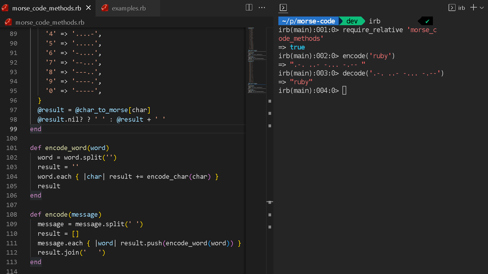

# Morse Code Encoder/Decoder

> Use the modules of this project to encode/decode string to Morse code

## Preview


## Prerequisites

Ruby >= 3.0.0

## Getting Started

- Run git clone on this project at the desired directory:
   ```
   git clone https://github.com/lfmnovaes/morse-code.git
   ```
- Go to the cloned directory with `cd morse-code`
- With Ruby installed in your environment, you can just run `ruby examples.rb` to see some outputs

## Authors

👤 **Luís Fernando**

- GitHub: [](https://github.com/lfmnovaes)
- Twitter: [](https://www.twitter.com/lfmnovaes/)
- LinkedIn: [](https://www.linkedin.com/in/lfmnovaes/)

👤 **Nacho Sala**

- GitHub: [@nachosala89](https://github.com/nachosala89)
- Twitter: [@nachosala89](https://twitter.com/nachosala89)
- LinkedIn: [Juan Ignacio Sala](https://www.linkedin.com/in/nacho-sala)

👤 **Ajayi Peter**

- GitHub: [@peterdgreat](https://github.com/peterdgreat)
- Twitter: [@dev_peter_O](https://twitter.com/dev_peter_O)
- LinkedIn: [ajayipeter](https://www.linkedin.com/in/ajayipeter)

## 🤝 Contributing

Contributions, issues, and feature requests are welcome!

Feel free to check the [issues page](../../issues/).

## Show your support

Give a ⭐️ if you like this project!

## Acknowledgments

- Microverse

## 📝 License

This project is [MIT](./LICENSE) licensed.
